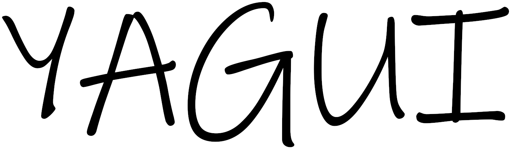

# Welcome to YAGUI Documentation v0.13.1

What does YAGUI stand for? **YAGUI** stands for "**Yet Another Graphical User Interface**", this library tries to make **GUIs easier to make and more powerful by having these objectives**:

* Has a Loop that makes **easier event management**;
* Can **draw and get events from multiple monitors**;
* Has a **screen buffer** which makes possible to simulate **transparency** when drawing;
* Has a **rednet based wireless screen sharing** system (Wireless Screen Share, WSS).

## Library Versions

**Versions** of the library **follow this format**: **M.m.b**

* M: **Major**, you should probably **rewrite most of your program to** get it to **work** with the new version.
* m: **Minor**, **look at the commit description** and see **if something** that was used in your program has **changed** and **check if it still works fine**.
* b: **Bug fixes**, **your program works as well as it worked on the last update**.

## Terminal Arguments

Terminal arguments are **options with which you can launch the library** to get information or make a new project easily.

* `help` Prints a **list of available Terminal Arguments**.
* `info` Prints **informations about the library**.
* `ver` Prints the **version of the library**.
* `copyright` Prints **library's copyright**.
* `setup` **Sets up the library by creating a new CraftOS's setting** which **stores the path to the library**, should be used every time you **move the library** and the **first time you download it**.
* `create <PATH>` Creates a **new YAGUI project** at `PATH`, a new project **contains the code needed to load the library**.

## Download & Installation

There are **two main ways of downloading the library**:

1. Downloading it from [**Raw GitHub**](https://raw.githubusercontent.com/hds536jhmk/YAGUI/master/YAGUI-mini.lua) using `wget`.
2. Running `pastebin run 5qQ6t6ZX` on the terminal.

By doing it with **the first method you just download the library**, by doing it with **the second one you also get some examples to try** as soon as you've set up the library.

**After you've downloaded it you should run it with** [setup argument](#terminal-arguments) **to install it**.

## Library Syntax

You should probably know how to **load the library**, you can use either [**dofile**](http://luatut.com/dofile.html) or [**require**](https://www.lua.org/pil/8.1.html), so you should put the name of the variable where you've stored the library in front of everything that you need to access from it separated with a `.` (e.g. `YAGUI.KEY_UP`).

Everything in the library is **snake_cased** (e.g. `string_utils`), except for **"classes"** that are **CamelCased** (e.g. `Loop`), **callbacks** that are **lowerCamelCased** (e.g. `Loop.callbacks.onClock`) and **constants** that are **UPPERCASED** (e.g. `ONCLOCK`) or **SCREAMING_SNAKE_CASED** (e.g. `KEY_UP`).

Most of the functions of the library **need to be called like this `table:function()` or `table.function(table)`**, **except for functions that are in tables that have "_utils"** at the end of their name.
